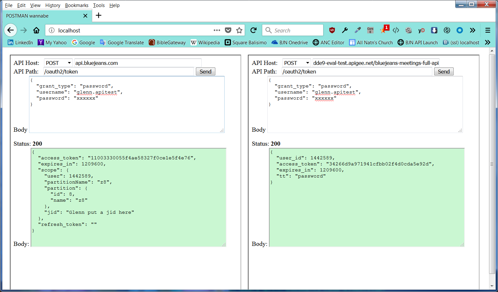

# Side by Side - a Simple NodeNS App for API Comparisons
aaaaaa
Have you ever wanted to see the returns from calls to two API sites in a way that is easy to compare the return values?

This is really helpful especially when testing API proxies.

## Setup
To use side by side, you will need to have the Node JS environment including the package manager too, **npm**.

1. Download the contents of this github to your computer.  Then run the initialization

	`npm install` to have npm download and install the npm modules

1. Launch the node web server

	`node index.js`  this should display the following

	`C:\Users\glinn\Documents\node\sidebyside>node index.js`
`API Test Comparison Server up, listening on port:  80 `

1. Open your browser and then browse to:
	
	`http://localhost`

At this point you should see the following screen:

## Running and Comparing

To use the web page, simply enter the API host name (for example: _api.bluejeans.com_) and select the type of API action (like: GET, PUT, etc).

Then select the API path you want to test:  `/oauth2/token` (for example).

Now just click the **send** button and observe the results

Repeat this for the other API site and now you can see the results of both API calls in a **_side by side_** manner..

